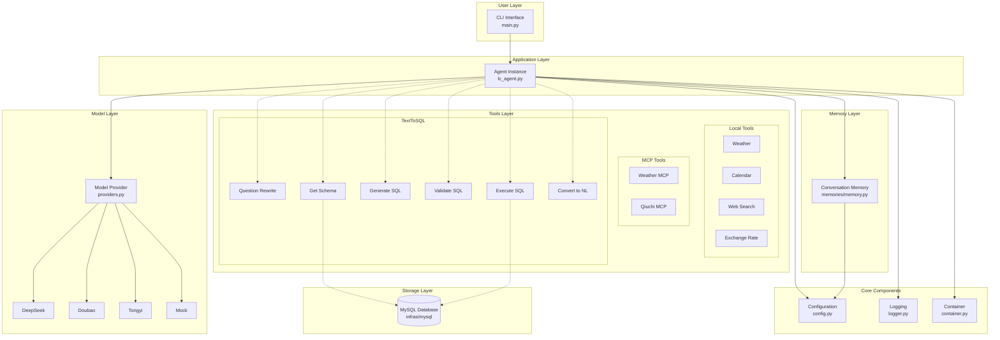
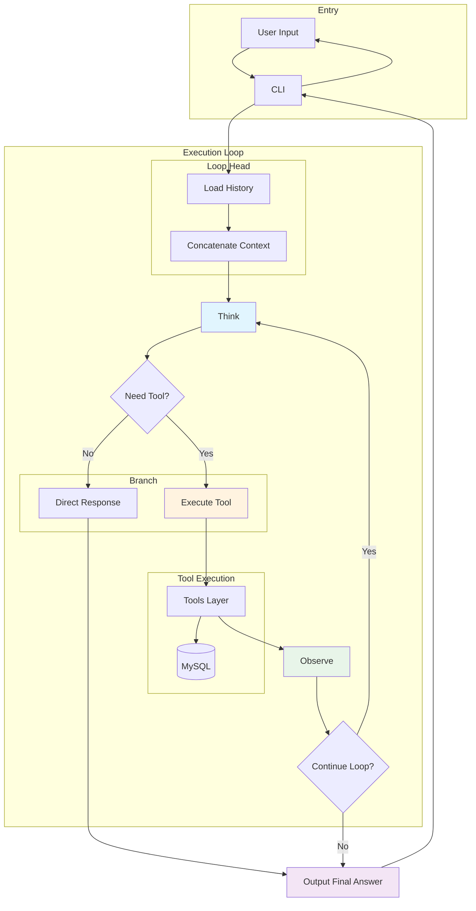
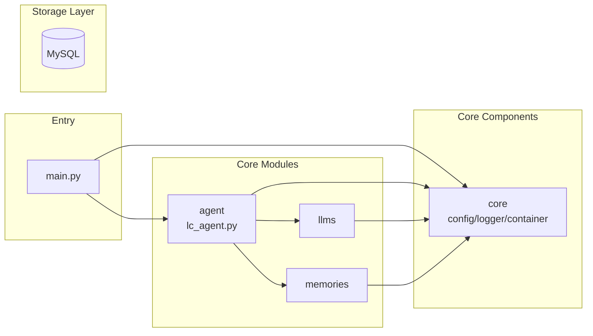

# x-langchain

> LangChain Learning and Practice Project - Building Production-Level LLM Applications with Best Practices

`x-langchain` is a comprehensive LangChain learning and practice project designed to help developers systematically learn and master the core concepts and application methods of the LangChain framework. This project demonstrates how to use LangChain to build large language model applications through practical cases, including model integration, tool calling, context management, and other key features, providing practical references for both beginners and advanced LangChain developers.

---

## 📌 Table of Contents

- [Core Features](#-core-features)
- [Quick Start](#-quick-start)
- [Project Structure](#-project-structure)
- [Configuration](#-configuration)
- [Usage](#-usage)
- [Testing](#-testing)
- [License](#-license)
- [Support and Contribution](#-support-and-contribution)

---

## ✨ Core Features

- **Multi-model Compatibility**: Supports mainstream LLM backends such as DeepSeek, Doubao, and Alibaba Tongyi Qianwen
- **Tool Calling (Function Calling)**: Integrates external APIs and business systems through a declarative interface
- **TextToSQL Functionality**: Supports natural language to SQL conversion, including question rewriting, Schema parsing, SQL generation, validation, and execution
- **Context Management**: Built-in dialogue history management, supporting continuous conversations
- **Security and Compliance**:
  - API key management (loaded from environment variables, avoiding hardcoding)
  - Input/output content filtering
- **Observability**: Integrated structured logging system for monitoring and debugging
- **Modern Architecture**: Built on LangChain, supporting type safety and modular design
- **Command-line Interface**: Provides a full-featured command-line tool supporting model selection and interactive dialogue

---

## 🚀 Quick Start

### Requirements

- Python 3.11 or higher
- Recommended to use [`uv`](https://github.com/astral-sh/uv) as package manager (also compatible with `pip`)

### Installation and Running

```bash
# Clone the project
git clone https://gitee.com/chain-engine/x-langchain.git
cd x-langchain

# Install dependencies (recommended to use uv)
uv sync

# Configure environment variables
cp .env.example .env
# Edit .env and fill in necessary API keys and database configuration

# Run AI assistant (enter interactive dialogue mode)
# Use default model (DeepSeek)
uv run src/main.py

# Or use installed command-line entry
uv run x-langchain

# Or specify model via environment variables
MODEL_NAME=deepseek uv run src/main.py
MODEL_NAME=doubao uv run src/main.py
MODEL_NAME=tongyi uv run src/main.py
```

---

## 📁 Project Structure

```
x-langchain/
├── src/                                # Source code directory
│   ├── main.py                         # Project main entry, CLI interface
│   ├── __init__.py                     # Package initialization
│   ├── core/                           # Core module
│   │   ├── __init__.py               # Core module exports
│   │   ├── config.py                  # Configuration management (pydantic-settings)
│   │   ├── logger.py                  # Logging system (loguru)
│   │   ├── container.py              # Dependency injection container
│   │   ├── middleware.py             # Middleware
│   │   └── exceptions.py             # Custom exceptions
│   ├── constants/                      # Constants module
│   │   ├── __init__.py               # Constants exports
│   │   ├── base.py                   # Base constants
│   │   ├── develop.py                 # Development constants
│   │   └── streaming_modes.py         # Streaming modes
│   ├── llms/                          # LLM module (model providers)
│   │   ├── __init__.py               # Module exports
│   │   └── providers.py               # Multi-model providers (DeepSeek/Doubao/Tongyi/Mock)
│   ├── memories/                        # Memories module (memory management)
│   │   ├── __init__.py               # Module exports
│   │   └── memory.py                 # Conversation memory (based on LangChain)
│   ├── agent/                        # Agent module (core)
│   │   ├── __init__.py               # Module exports
│   │   └── lc_agent.py               # LangChain Agent implementation (based on LangGraph)
│   ├── tools/                        # Tools module (tool system)
│   │   ├── __init__.py               # Tools module exports
│   │   ├── registry.py               # Tool registry
│   │   ├── weather_tool.py           # Weather query
│   │   ├── calendar_tool.py          # Calendar query
│   │   ├── web_tool.py               # Web search
│   │   ├── exchange_rate_tool.py     # Exchange rate query
│   │   ├── qiuchi_mcp/               # Qiuchi MCP tools
│   │   └── text_to_sql/              # TextToSQL toolchain
│   │       ├── __init__.py
│   │       ├── question_rewrite_tool.py    # Question rewriting
│   │       ├── get_schema_tool.py         # Schema parsing
│   │       ├── generate_sql_tool.py       # SQL generation
│   │       ├── validate_sql_tool.py       # SQL validation
│   │       ├── execute_sql_tool.py        # SQL execution
│   │       └── convert_to_natural_language_tool.py  # Result conversion
│   └── infras/                        # Infrastructure layer
│       └── mysql/                    # MySQL database module
│           ├── __init__.py
│           ├── models.py              # ORM models
│           ├── mysql.py               # Database connection
│           └── operations.py          # Database operations
├── tests/                             # Test module
├── docs/                              # Documentation
├── examples/                          # Examples
├── logs/                              # Logs directory
├── .env.example                       # Environment variables example
├── pyproject.toml                     # Project metadata and dependencies
├── Dockerfile                         # Docker build file
└── README.md                          # Project documentation
```

> **Note**: The Agent's "planning" and "action" capabilities are provided by LangChain/LangGraph's ReAct Agent, integrated into `agent/lc_agent.py`, not as a separate module.

---

## 🏗️ System Architecture

### Core Architecture

```
┌─────────────────────────────────────────────────────────────────┐
│                          Agent (Coordinator)                    │
│  ┌─────────────┬─────────────┬─────────────┬─────────────┐    │
│  │    LLM     │   Memory    │   ReAct    │   Tools    │    │
│  │  (Brain)   │   (Memory)  │ (Reasoning)│  (Execute) │    │
│  └─────────────┴─────────────┴─────────────┴─────────────┘    │
└─────────────────────────────────────────────────────────────────┘

Technology: Built on LangChain / LangGraph, ReAct paradigm unifies reasoning and execution
```

### Component Responsibilities

| Component | Directory | Responsibility |
|-----------|----------|----------------|
| LLM | `llms/` | Unified multi-model providers (DeepSeek/Doubao/Tongyi/Mock) |
| Memory | `memories/` | Conversation history (based on LangChain ChatMessageHistory) |
| ReAct Agent | `agent/` | Reasoning-action loop, based on LangGraph |
| Tools | `tools/` | Plugin-based tool system (weather/search/database/MCP) |

### Layered Architecture



> **Notes**:
> - Core Components: Configuration, logging, dependency injection container
> - Memory Layer: Conversation history management (based on LangChain ChatMessageHistory)
> - Tools Layer: TextToSQL chain - Question Rewrite → Get Schema → Generate SQL → Validate → Execute → Convert to NL
> - Storage Layer: MySQL database, required by Schema parsing and SQL execution

### Core Business Flow (ReAct Loop)



> **Technology**: Based on LangGraph for state machine management, supporting multi-round ReAct loops

> **Notes**:
> - Think: LLM reasoning - decide if tool is needed
> - Act: Execute tool calls (e.g., TextToSQL query)
> - Observe: Get tool result, feedback to LLM for continued reasoning

### Module Dependencies



> **Note**: Agent reasoning and action dispatch are implemented by LangChain/LangGraph, no separate Planning/Action modules needed.

---

## ⚙️ Configuration

### Environment Variable Configuration

The project uses a `.env` file to store configuration information, including the following configuration items:

#### DeepSeek Configuration

```env
# DeepSeek API
DEEPSEEK_API_KEY=sk-xxxxxxxxxxxxxxxxxxxxxxxxxxxxxxxx
DEEPSEEK_API_BASE=https://api.deepseek.com/v1
DEEPSEEK_MODEL_NAME=deepseek-chat
```

#### Doubao Configuration

```env
# Doubao API
DOUBAO_API_KEY=xxxxxxxx-xxxx-xxxx-xxxx-xxxxxxxxxxxx
DOUBAO_API_BASE=https://ark.cn-beijing.volces.com/api/v3
DOUBAO_MODEL_NAME=ep-xxxxxxxxxxxxxx
```

#### Alibaba Cloud Configuration

```env
# Alibaba Cloud API
ALIYUN_API_KEY=sk-xxxxxxxxxxxxxxxxxxxxxxxxxxxxxxxx
ALIYUN_MODEL_NAME=qwen-plus
```

#### Database Configuration (for TextToSQL)

```env
# Database configuration
DB_HOST=192.168.111.222
DB_PORT=3306
DB_USER=root
DB_PASSWORD=123456
DB_NAME=yeyushilai
DB_URL=mysql+pymysql://${DB_USER}:${DB_PASSWORD}@${DB_HOST}:${DB_PORT}/${DB_NAME}
```

#### General Configuration

```env
# General configuration
TEMPERATURE=0.0
DEBUG=False
STRUCTURED=False
```

---

## 📖 Usage

### Command-line Interface

The project provides a full-featured command-line entry:

```bash
# Enter interactive dialogue mode (using default model DeepSeek)
uv run src/main.py

# Or use installed command-line entry
uv run x-langchain

# Or specify model via environment variables
MODEL_NAME=deepseek uv run src/main.py
MODEL_NAME=doubao uv run src/main.py
MODEL_NAME=tongyi uv run src/main.py
```

### Interactive Dialogue Mode

After starting the program, it will enter interactive dialogue mode:

```bash
$ uv run src/main.py

==================================================
Welcome to the AI Assistant! Enter 'exit', 'quit' or '退出' to end the conversation
==================================================

You: How's the weather in Shanghai?

2026-03-05 10:00:00,123 - INFO - Query result:
Shanghai is cloudy today, temperature 18°C, east wind level 3, humidity 65%, good air quality.

You: Help me query the number of users in the database

2026-03-05 10:01:00,456 - INFO - Query result:
According to the database query, there are currently 150 users in the system.

You: exit

Thank you for using, goodbye!
```

### Model Selection

You can select the model via environment variable `MODEL_NAME`:

- `deepseek`: Use DeepSeek model (default)
- `doubao`: Use Doubao model
- `tongyi`: Use Alibaba Tongyi Qianwen model

Example:

```bash
# Use DeepSeek (default)
uv run src/main.py

# Use Doubao
MODEL_NAME=doubao uv run src/main.py

# Use Tongyi
MODEL_NAME=tongyi uv run src/main.py
```

---

## 🧪 Testing

### Running Tests

The project provides a comprehensive test suite to ensure code quality:

```bash
# Run all tests
uv run python -m pytest

# Run specific test modules
uv run python -m pytest tests/test_settings.py -v
uv run python -m pytest tests/test_weather_tool.py -v
uv run python -m pytest tests/test_providers.py -v
```

### Code Quality

- **Type Checking**: Uses Python type annotations to ensure type safety
- **Error Handling**: Added detailed error handling and fault tolerance mechanisms
- **Logging System**: Integrated unified logging system for monitoring and debugging
- **Modular Design**: Adopts modular design to improve code maintainability and extensibility

---

## 📄 License

This project is licensed under the MIT License. See the [LICENSE](LICENSE) file for details.

---

## 🤝 Support and Contribution

### Support

If you encounter any issues during use, please get support through the following channels:

- Check [LangChain Official Documentation](https://python.langchain.com/docs/get_started/introduction)
- Check [Project Documentation](README.md)
- Submit [GitHub Issue](https://gitee.com/chain-engine/x-langchain/issues)

### Contribution

We welcome community contributions, including but not limited to:

- Fixing bugs
- Adding new features
- Improving documentation
- Optimizing performance

Please submit your contributions through GitHub Pull Request.

---

## Reference Documentation

- [LangChain Official Documentation](https://python.langchain.com/docs/get_started/introduction)
- [DeepSeek Official Documentation](https://platform.deepseek.com/docs/api)
- [Doubao Official Documentation](https://www.doubao.com/)
- [Alibaba Cloud Tongyi Qianwen Official Documentation](https://help.aliyun.com/product/1081203.html)
