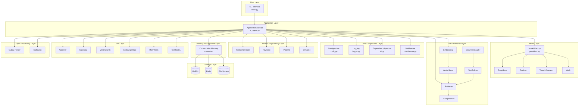
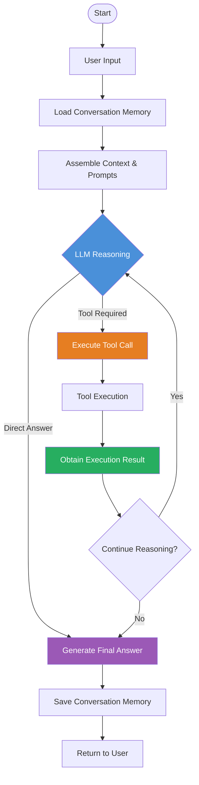
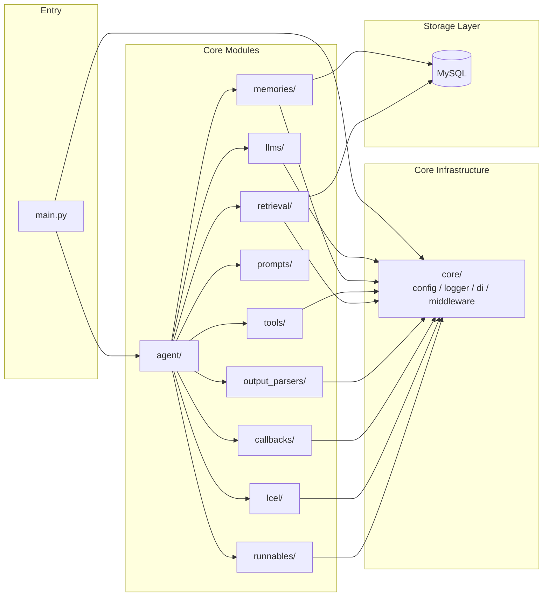

# x-langchain

[](LICENSE)
[](https://www.python.org/)
[](https://python.langchain.com/)
[](https://github.com/chain-engine/x-langchain/stargazers)

[中文](README.md) | English

---

## Introduction

`x-langchain` is a production-grade LangChain learning and practice project designed to help developers systematically learn and master the core concepts and engineering practices of the LangChain framework.

Built on the LangChain / LangGraph ecosystem, it provides out-of-the-box multi-model compatibility, a pluggable tool system, a complete RAG toolchain, and a TextToSQL solution. The core architecture revolves around an Agent orchestrator, integrating the ReAct reasoning paradigm, multi-turn memory management, declarative tool registration, and MCP protocol support. It covers typical business scenarios from intelligent conversation and data querying to enterprise knowledge base Q&A, making it suitable for both LLM application prototyping and production-grade deployment.

---

## Key Features

- **Multi-Model Compatibility** — Unified model factory supporting DeepSeek, Doubao, Alibaba Cloud Tongyi Qianwen, and other mainstream LLM backends; switch with a single environment variable
- **Agent Capability** — LangGraph-based ReAct Agent with a closed loop of five core capabilities: Model, Planning, Action, Tools, and Memory
- **Tool Calling (Function Calling)** — Declarative tool registration with decorator-based auto-discovery and hot-plugging; supports external API and business system integration
- **TextToSQL Toolchain** — Full pipeline from natural language to SQL: Question Rewriting → Schema Parsing → SQL Generation → Validation & Execution → Result Conversion
- **MCP Protocol Support** — Integrated Model Context Protocol via langchain-mcp-adapters for MCP tool ecosystem access
- **Complete RAG Toolchain** — Embedding, VectorStore, DocumentLoader, TextSplitter, Retriever, and Semantic Memory for end-to-end retrieval-augmented generation
- **Multiple Memory Implementations** — Buffer, Summary, Window, Entity, CombinedMemory with multi-backend persistence (Redis / File / PostgreSQL / MongoDB)
- **Output Parsers** — JSON, Pydantic, XML, Datetime, Structured Output, and more, with retry and fault tolerance support
- **Callback System** — Token counting, latency analysis, LangSmith tracing, AIM monitoring, file logging for full-chain observability
- **LCEL Support** — LangChain Expression Language chaining with async execution and dynamic model selection
- **Security & Compliance** — API keys loaded from environment variables; configuration files separated from code to avoid hardcoded secrets
- **Pluggable Architecture** — Modular layered design with loosely coupled core components for easy extension and secondary development

---

## Project Structure

```
x-langchain/
├── src/                                    # Source code directory
│   ├── __init__.py                         # Package initialization, exports all modules
│   ├── main.py                             # Project entry point, CLI interface
│   │
│   ├── core/                               # Core infrastructure layer
│   │   ├── config.py                       # Unified configuration management (pydantic-settings + YAML)
│   │   ├── logger.py                       # Logging system (loguru)
│   │   ├── di.py                           # Dependency injection container
│   │   ├── middleware.py                   # Middleware (input validation / timing / iteration limiting)
│   │   └── exceptions.py                   # Custom exception hierarchy
│   │
│   ├── llms/                               # LLM model layer
│   │   └── providers.py                    # Multi-model factory (DeepSeek / Doubao / Tongyi Qianwen / Mock)
│   │
│   ├── memories/                           # Memory management layer
│   │   ├── memory.py                       # Basic memory (ChatMessageHistory / BufferMemory)
│   │   ├── advanced_memory.py              # Advanced memory (Summary / Window / Entity / Combined)
│   │   └── chat_history.py                # Multi-backend storage (Redis / File / PostgreSQL / MongoDB)
│   │
│   ├── agent/                              # Agent orchestration layer
│   │   └── lc_agent.py                     # LangGraph ReAct Agent implementation
│   │
│   ├── tools/                              # Tool layer (pluggable architecture)
│   │   ├── base.py                         # Tool base class (BaseXTool)
│   │   ├── registry.py                     # Tool registry (decorator-based auto-registration)
│   │   ├── weather_tool.py                 # Weather query (Amap)
│   │   ├── calendar_tool.py               # Calendar query
│   │   ├── web_tool.py                     # Web search (DuckDuckGo)
│   │   ├── exchange_rate_tool.py           # Exchange rate query
│   │   ├── qiuchi_mcp/                    # Qiuchi MCP tool package
│   │   └── text_to_sql/                   # TextToSQL toolchain
│   │       ├── question_rewrite_tool.py    # Question rewriting
│   │       ├── get_schema_tool.py          # Schema parsing
│   │       ├── generate_sql_tool.py        # SQL generation
│   │       ├── validate_sql_tool.py        # SQL validation
│   │       ├── execute_sql_tool.py         # SQL execution
│   │       └── convert_to_natural_language_tool.py  # Result conversion
│   │
│   ├── prompts/                            # Prompt engineering layer
│   │   ├── prompt_loader.py               # YAML template loader (with variable rendering)
│   │   ├── templates.py                    # Basic templates (PromptTemplate / ChatPromptTemplate)
│   │   ├── few_shot.py                     # Few-shot templates
│   │   ├── advanced_templates.py           # Advanced templates (Pipeline / ChatMessage / FewShotChat)
│   │   └── templates/                      # YAML prompt file directory
│   │       ├── agent_system.yaml           # Agent system prompt
│   │       ├── question_rewrite.yaml       # Question rewriting prompt
│   │       ├── generate_sql.yaml           # SQL generation prompt
│   │       └── convert_to_natural_language.yaml  # Result conversion prompt
│   │
│   ├── chains/                             # Chain layer
│   │   ├── llm_chain.py                    # LLM chain
│   │   ├── conversation_chain.py           # Conversation chain
│   │   └── rag_chain.py                    # RAG chain
│   │
│   ├── retrieval/                          # RAG retrieval layer
│   │   ├── embedding.py                    # Embedding factory (OpenAI / DashScope / Local / Mock)
│   │   ├── vectorstore.py                 # VectorStore factory (Chroma / FAISS / InMemory)
│   │   ├── document.py                     # Document / DocumentLoader / DirectoryLoader
│   │   ├── splitter.py                     # TextSplitter (Recursive / Token)
│   │   ├── retriever.py                    # Retriever (Vector / Ensemble / MultiQuery)
│   │   ├── compression.py                 # Compression retriever (LLMCompactor / ChainFilter)
│   │   └── semantic_memory.py             # Semantic memory
│   │
│   ├── output_parsers/                     # Output parser layer
│   │   ├── json_parser.py                  # JSON parser
│   │   ├── pydantic_parser.py             # Pydantic model parser
│   │   ├── list_parser.py                  # List parser
│   │   ├── retry_parser.py                # Retry parser
│   │   └── structured_parser.py           # Structured / XML / Datetime parser
│   │
│   ├── callbacks/                          # Observability layer
│   │   ├── handlers.py                     # Standard handlers (Token / Timing / Tracing / Streaming)
│   │   └── community_handlers.py           # Community handlers (StdOut / AIM / File / SensitiveInfo)
│   │
│   ├── runnables/                          # Runnable module (LCEL utilities)
│   │   ├── async_agent.py                  # Async agent
│   │   ├── configurable.py                # Dynamic LLM selection
│   │   └── routines.py                     # Chain invocation helpers
│   │
│   ├── lcel/                               # LCEL module (LangChain Expression Language)
│   │   ├── chain.py                        # LCEL chain invocation
│   │   └── lcel_utils.py                  # LCEL utility functions
│   │
│   ├── constants/                          # Constants module
│   │   ├── base.py                         # Base constants
│   │   ├── develop.py                      # Development-related constants
│   │   ├── streaming_modes.py              # Streaming modes
│   │   └── agent.py                        # Agent mode enumeration
│   │
│   └── infras/                             # Infrastructure layer
│       └── mysql/                          # MySQL database
│           ├── models.py                   # ORM model definitions
│           ├── mysql.py                     # Database connection management
│           └── operations.py               # Database operation wrappers
│
├── tests/                                  # Unit tests
├── docs/                                   # Project documentation
├── examples/                               # Example code (25+ examples)
├── logs/                                   # Runtime log output directory
├── data/                                   # Data files directory
├── config.yaml                             # YAML configuration file
├── .env.example                            # Environment variable template
├── pyproject.toml                          # Project metadata and dependency management
├── uv.toml                                 # uv package manager configuration
├── pyrightconfig.json                      # Pyright type checking configuration
├── langgraph.json                          # LangGraph deployment configuration
├── Dockerfile                              # Docker container build file
├── setup.py                                # Compatibility installation script
└── LICENSE                                 # MIT open source license
```

---

## System Architecture

### Layered Architecture Diagram



### ReAct Execution Flow



### Module Dependency Diagram



---

## Quick Start

### 1. Prerequisites

| Platform | Requirements |
|----------|-------------|
| **Windows** | Python 3.11+, PowerShell or Git Bash recommended |
| **Linux** | Python 3.11+, any Shell |
| **macOS** | Python 3.11+, any Shell (Apple Silicon users should ensure matching Python build architecture) |

> [`uv`](https://github.com/astral-sh/uv) is recommended as the package manager for its speed and dependency resolution capabilities

### 2. Clone the Repository

```bash
git clone https://github.com/chain-engine/x-langchain.git
cd x-langchain
```

### 3. Install & Sync Dependencies

```bash
# Using uv (recommended)
uv sync

# Install optional dependencies (e.g., Gradio UI)
uv sync --extra ui
```

### 4. Environment Configuration

Copy the environment variable template and edit it:

```bash
cp .env.example .env
```

Core parameters in `.env`:

```env
# ===== LLM Model Configuration (choose one) =====

# DeepSeek (recommended)
DEEPSEEK_API_KEY=sk-xxxxxxxxxxxxxxxxxxxxxxxxxxxxxxxx
DEEPSEEK_API_BASE=https://api.deepseek.com/v1
DEEPSEEK_MODEL_NAME=deepseek-v4-pro

# Doubao
DOUBAO_API_KEY=xxxxxxxx-xxxx-xxxx-xxxx-xxxxxxxxxxxx
DOUBAO_API_BASE=https://ark.cn-beijing.volces.com/api/v3
DOUBAO_MODEL_NAME=ep-xxxxxxxxxxxxxx

# Alibaba Cloud Tongyi Qianwen
ALIYUN_API_KEY=sk-xxxxxxxxxxxxxxxxxxxxxxxxxxxxxxxx
ALIYUN_MODEL_NAME=qwen-plus

# ===== Database Configuration (required for TextToSQL) =====
DB_HOST=localhost
DB_PORT=3306
DB_USER=root
DB_PASSWORD=your_password
DB_NAME=your_database

# ===== Tool Configuration =====
AMAP_API_KEY=your_amap_api_key      # Amap weather query
MCP_ENABLED=false                    # MCP protocol toggle
```

You can also edit `config.yaml` to adjust advanced settings for Agent, logging, middleware, etc.

### 5. Start the Service

#### Local Development

```bash
# Using the default model (DeepSeek)
uv run src/main.py

# Or use the registered CLI entry point
uv run x-langchain

# Specify model via environment variable
MODEL_NAME=deepseek uv run src/main.py
MODEL_NAME=doubao   uv run src/main.py
MODEL_NAME=tongyi   uv run src/main.py
```

#### Docker Deployment

```bash
# Build the image
docker build -t x-langchain:latest .

# Linux / macOS
docker run -it --rm \
  -v $(pwd)/.env:/app/.env:ro \
  -v $(pwd)/logs:/app/logs \
  x-langchain:latest

# Windows PowerShell
docker run -it --rm `
  -v ${PWD}/.env:/app/.env:ro `
  -v ${PWD}/logs:/app/logs `
  x-langchain:latest
```

### 6. Common Engineering Commands

```bash
# Run unit tests
uv run pytest tests/ -v

# Test coverage report
uv run pytest tests/ --cov=src --cov-report=term-missing

# Code formatting
uv run ruff format src/ tests/

# Static code analysis
uv run ruff check src/ tests/

# Auto-fix fixable lint issues
uv run ruff check --fix src/ tests/

# Type checking
uv run pyright
```

---

## Tech Stack

| Category | Technology |
|----------|-----------|
| **Core Framework** | LangChain, LangGraph, langchain-core |
| **Model Integration** | langchain-openai, langchain-community, langchain-dashscope, langchain-anthropic |
| **MCP Protocol** | langchain-mcp-adapters |
| **Data Storage** | MySQL (SQLAlchemy + PyMySQL / aiomysql) |
| **Caching** | Redis (optional, for ChatHistory persistence) |
| **Core Libraries** | pydantic, pydantic-settings, python-dotenv, pyyaml, duckduckgo-search, requests |
| **Logging** | loguru |
| **Type Checking** | Pyright |
| **Code Quality** | Ruff (formatting + linting) |
| **Testing** | pytest, pytest-cov |
| **Package Management** | uv |
| **Deployment** | Docker |

---

## License

This project is licensed under the [MIT License](LICENSE).

---

## References

- [Python Official Documentation](https://docs.python.org/3.11/)
- [LangChain Official Documentation](https://python.langchain.com/)
- [LangGraph Official Documentation](https://langchain-ai.github.io/langgraph/)
- [uv Official Documentation](https://docs.astral.sh/uv/)
- [Pydantic Official Documentation](https://docs.pydantic.dev/)
- [SQLAlchemy Official Documentation](https://docs.sqlalchemy.org/)
- [loguru Official Documentation](https://loguru.readthedocs.io/)
- [Ruff Official Documentation](https://docs.astral.sh/ruff/)
- [Docker Official Documentation](https://docs.docker.com/)

---

## Contact

- **Author**: John Young
- **Email**: john.young@foxmail.com
- **Gitee**: https://gitee.com/yeyushilai
- **GitHub**: https://github.com/yeyushilai
