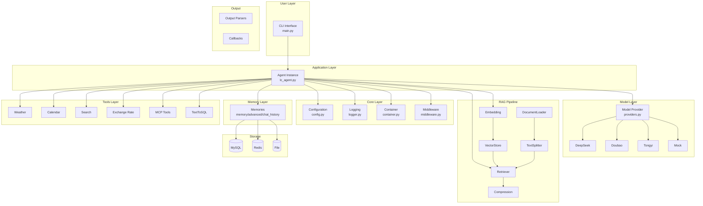
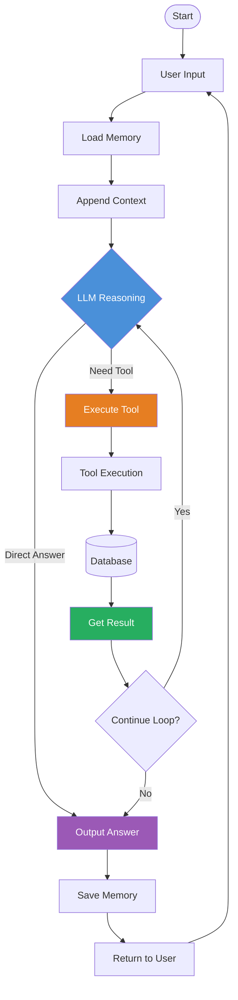
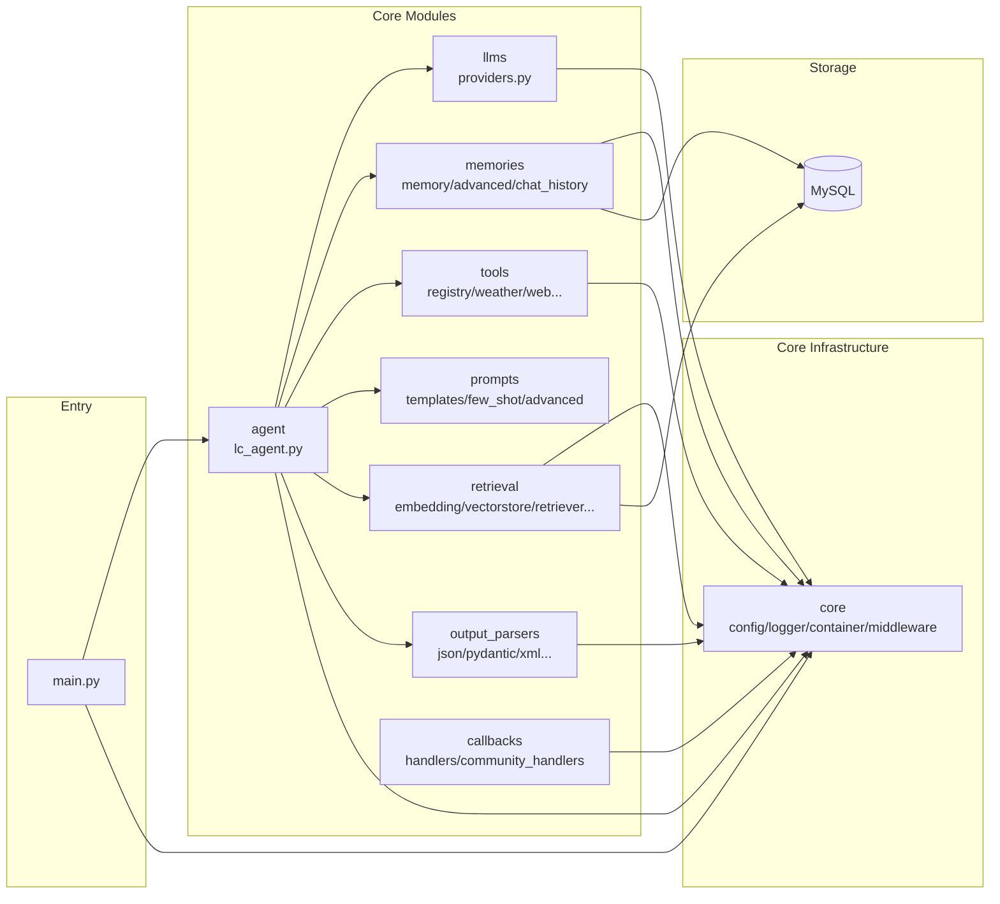

# x-langchain

> LangChain Learning and Practice Project - Building Production-Level LLM Applications with Best Practices

`x-langchain` is a comprehensive LangChain learning and practice project designed to help developers systematically learn and master the core concepts and application methods of the LangChain framework.

**Core Value**: Out-of-the-box multi-model support, plugin-based tool system, complete TextToSQL solution

**Use Cases**: Intelligent customer service, data query assistants, enterprise knowledge base Q&A, LLM application prototyping

---

## Table of Contents

- [Core Features](#core-features)
- [Tech Stack](#tech-stack)
- [Project Structure](#project-structure)
- [System Architecture](#system-architecture)
- [Quick Start](#quick-start)
- [Core Modules](#core-modules)
- [Plugin Tool System](#plugin-tool-system)
- [Configuration](#configuration)
- [License](#license)

---

## Core Features

- **Multi-model Compatibility** - Supports DeepSeek, Doubao, Alibaba Tongyi Qianwen, and other mainstream LLM backends
- **Agent Capabilities** - LangGraph ReAct Agent with Model, Plan, Act, Tools, Memory五大核心能力
- **Tool Calling (Function Calling)** - Integrates external APIs and business systems through declarative interface
- **TextToSQL Functionality** - Natural language to SQL conversion: question rewriting, Schema parsing, SQL generation, validation, and execution
- **MCP Protocol Support** - Integrates Model Context Protocol with MCP tool calling
- **Complete RAG Pipeline** - Embedding, VectorStore, DocumentLoader, TextSplitter, Retriever, SemanticMemory
- **Multiple Memory Implementations** - Buffer, Summary, Window, Entity, CombinedMemory with Redis/File/Postgres/MongoDB persistence
- **Output Parsers** - JSON, Pydantic, XML, Datetime, Structured output parsers
- **Callback System** - Token statistics, timing analysis, LangSmith tracing, AIM monitoring, file logging
- **Security & Compliance** - API key management (loaded from environment variables, no hardcoding)
- **Observability** - Integrated structured logging system for monitoring and debugging
- **Plugin Architecture** - Decorator-based tool auto-registration with hot-swapping support

---

## Tech Stack

| Category | Technology |
|----------|------------|
| **Core Framework** | LangChain, LangGraph, langchain-core |
| **Model Integration** | langchain-openai, langchain-community, langchain-dashscope |
| **Configuration** | pydantic-settings, python-dotenv |
| **Tools** | duckduckgo-search, sqlalchemy, pymysql |
| **MCP Protocol** | langchain-mcp-adapters |
| **Logging** | loguru |
| **Package Manager** | uv |
| **Deployment** | Docker |

---

## Project Structure

```
x-langchain/
├── src/                                # Source code
│   ├── __init__.py                     # Package init, export all modules
│   ├── main.py                         # CLI entry point
│   │
│   ├── core/                           # Core infrastructure
│   │   ├── config.py                   # Configuration (pydantic-settings)
│   │   ├── logger.py                   # Logging (loguru)
│   │   ├── container.py                # Dependency injection
│   │   ├── middleware.py               # Middleware (validation/timing/limits)
│   │   └── exceptions.py               # Custom exceptions
│   │
│   ├── llms/                           # LLM providers
│   │   └── providers.py                 # Multi-model factory (DeepSeek/Doubao/Tongyi/Mock)
│   │
│   ├── memories/                        # Memory management
│   │   ├── memory.py                  # Basic memory (ChatMessageHistory/BufferMemory)
│   │   ├── advanced_memory.py          # Advanced (Summary/Window/Entity/Combined)
│   │   └── chat_history.py             # Storage backends (Redis/File/Postgres/MongoDB)
│   │
│   ├── agent/                         # Agent module
│   │   ├── lc_agent.py                # LangGraph ReAct Agent
│   │   └── chat_history_service.py     # MySQL persistence
│   │
│   ├── tools/                         # Tool system
│   │   ├── base.py                    # Tool base class (BaseXTool)
│   │   ├── registry.py                 # Tool registry
│   │   ├── weather_tool.py             # Weather (AMAP)
│   │   ├── calendar_tool.py            # Calendar
│   │   ├── web_tool.py                # Search (duckduckgo)
│   │   ├── exchange_rate_tool.py       # Exchange rate
│   │   ├── qiuchi_mcp/                # Qiuchi MCP tools
│   │   └── text_to_sql/              # TextToSQL chain
│   │
│   ├── prompts/                        # Prompt templates
│   │   ├── templates.py               # Basic (PromptTemplate/ChatPromptTemplate)
│   │   ├── few_shot.py               # Few-shot templates
│   │   └── advanced_templates.py       # Advanced (Pipeline/ChatMessage/FewShotChat)
│   │
│   ├── chains/                         # Chain module
│   │   ├── llm_chain.py              # LLMChain
│   │   ├── conversation_chain.py       # Conversation chain
│   │   └── rag_chain.py              # RAG chain
│   │
│   ├── retrieval/                      # RAG infrastructure
│   │   ├── embedding.py                # Embedding (OpenAI/DashScope/Local/Mock)
│   │   ├── vectorstore.py             # VectorStore (Chroma/FAISS/InMemory)
│   │   ├── document.py                # Document/Loader
│   │   ├── splitter.py                # TextSplitter (Recursive/Token)
│   │   ├── retriever.py               # Retriever (Vector/Ensemble/MultiQuery)
│   │   ├── compression.py             # Compression retriever
│   │   └── semantic_memory.py          # Semantic memory
│   │
│   ├── output_parsers/                 # Output parsers
│   │   ├── json_parser.py             # JSON parser
│   │   ├── pydantic_parser.py         # Pydantic parser
│   │   ├── list_parser.py             # List parser
│   │   ├── retry_parser.py            # Retry parser
│   │   └── structured_parser.py         # Structured/XML/Datetime parsers
│   │
│   ├── callbacks/                      # Callbacks (observability)
│   │   ├── handlers.py                # Standard (Token/Timing/Tracing/Streaming)
│   │   └── community_handlers.py       # Community (StdOut/AIM/File/SensitiveInfo)
│   │
│   ├── runnables/                     # LCEL utilities
│   │   ├── async_agent.py             # Async agent
│   │   ├── configurable.py            # Dynamic LLM selection
│   │   └── routines.py                # Chain helpers
│   │
│   ├── lcel/                          # LCEL module
│   │   ├── chain.py                  # LCEL chains
│   │   └── lcel_utils.py             # LCEL utilities
│   │
│   ├── constants/                      # Constants
│   │   ├── base.py                   # Base constants
│   │   ├── develop.py                 # Development constants
│   │   ├── streaming_modes.py         # Streaming modes
│   │   └── agent.py                   # Agent modes
│   │
│   └── infras/                        # Infrastructure
│       └── mysql/                    # MySQL
│           ├── models.py              # ORM models
│           ├── mysql.py               # Connection
│           └── operations.py          # Operations
│
├── tests/                              # Tests
├── docs/                               # Documentation
├── examples/                           # Examples
├── logs/                               # Logs
├── .env.example                        # Config template
├── pyproject.toml                      # Dependencies
├── Dockerfile                          # Docker
└── README.md                           # Docs
```

---

## System Architecture

### Core Architecture

```
┌─────────────────────────────────────────────────────────────────┐
│                        Agent (Coordinator)                        │
│  ┌──────────┬──────────┬──────────┬──────────┬──────────┐    │
│  │   LLM   │  Memory  │   Plan   │   Act    │  Tools   │    │
│  │  (Brain)│ (Memory) │ (Reason) │  (Exec)  │ (Tools)  │    │
│  └──────────┴──────────┴──────────┴──────────┴──────────┘    │
└─────────────────────────────────────────────────────────────────┘
                              │
                              ▼
              ┌───────────────────────────────┐
              │     LangChain / LangGraph        │
              │   ReAct paradigm for reasoning   │
              └───────────────────────────────┘
```

### Component Responsibilities

| Component | Directory | Responsibility |
|-----------|-----------|----------------|
| LLM | `llms/` | Multi-model factory (DeepSeek/Doubao/Tongyi/Mock) |
| Memory | `memories/` | Basic + Advanced + Multiple persistence backends |
| Plan/Act | `agent/` | ReAct loop based on LangGraph |
| Tools | `tools/` | Plugin system (weather/search/database/MCP/TextToSQL) |
| Retrieval | `retrieval/` | RAG pipeline (Embedding/VectorStore/Retriever) |
| Output Parser | `output_parsers/` | Structured output (JSON/Pydantic/XML/Datetime) |
| Callback | `callbacks/` | Token stats/timing/logging/tracing |

### Layered Architecture



### ReAct Execution Loop



### Module Dependencies



---

## Quick Start

### Requirements

| Environment | Requirements |
|-------------|--------------|
| **Windows** | Python 3.11+, PowerShell or Git Bash |
| **Linux/macOS** | Python 3.11+, any Shell |

> Recommended to use [`uv`](https://github.com/astral-sh/uv) as package manager

### Installation

```bash
# Clone
git clone https://github.com/chain-engine/x-langchain.git
cd x-langchain

# Install dependencies
uv sync

# Configure
cp .env.example .env
# Edit .env with your API keys
```

### Run

```bash
# Default model (DeepSeek)
uv run src/main.py

# Or use environment variable
MODEL_NAME=deepseek uv run src/main.py
MODEL_NAME=doubao uv run src/main.py
MODEL_NAME=tongyi uv run src/main.py
```

### Docker

```bash
# Build
docker build -t x-langchain:latest .

# Run
docker run -it --rm \
  -v $(pwd)/.env:/app/.env:ro \
  -v $(pwd)/logs:/app/logs \
  x-langchain:latest
```

---

## Core Modules

### 1. Memories Module

```python
from memories import (
    # Basic
    ConversationMemory,
    BufferMemory,

    # Advanced
    ConversationSummaryMemory,
    ConversationBufferWindowMemory,
    ConversationEntityMemory,
    CombinedMemory,

    # Storage backends
    create_chat_history,
    RedisChatHistory,
    FileChatHistory,
    PostgresChatHistory,
    MongoDBChatHistory,
)
```

### 2. Retrieval Module

```python
from retrieval import (
    # Embedding
    EmbeddingFactory,
    OpenAIEmbedding,
    DashScopeEmbedding,
    LocalEmbedding,

    # VectorStore
    VectorStoreFactory,
    ChromaVectorStore,
    FAISSVectorStore,
    InMemoryVectorStore,

    # Document & Splitter
    Document,
    DocumentLoader,
    RecursiveTextSplitter,

    # Retriever
    VectorRetriever,
    EnsembleRetriever,
    MultiQueryRetriever,
    ContextualCompressionRetriever,
)
```

### 3. Output Parsers Module

```python
from output_parsers import (
    # Basic
    JsonOutputParser,
    PydanticOutputParser,
    StrOutputParser,
    CommaSeparatedListOutputParser,
    RetryOutputParser,

    # Advanced
    StructuredOutputParser,
    XmlOutputParser,
    DatetimeOutputParser,
)
```

### 4. Callbacks Module

```python
from callbacks import (
    # Standard
    TokenCountCallbackHandler,
    TimingCallbackHandler,
    TracingCallbackHandler,
    StreamingCallbackHandler,

    # Community
    StdOutCallbackHandler,
    AimCallbackHandler,
    FileCallbackHandler,
    SensitiveInfoCallbackHandler,
    EventLogCallbackHandler,
)
```

### 5. Prompts Module

```python
from prompts import (
    # Basic
    PromptTemplate,
    ChatPromptTemplate,
    FewShotPromptTemplate,

    # Advanced
    PipelinePromptTemplate,
    ChatMessagePromptTemplate,
    FewShotChatMessagePromptTemplate,
    DynamicPipelinePromptTemplate,
)
```

---

## Plugin Tool System

Create new tools in 3 steps:

```python
# 1. Create file in tools/
# tools/my_tool.py

# 2. Use decorator
from tools.registry import register_tool

@register_tool(name="my_tool", category="custom", description="My tool")
class MyTool:
    def __init__(self):
        self.name = "my_tool"
        self.description = "My custom tool"

    def run(self, param: str) -> str:
        return f"Processed: {param}"

# 3. Done! Auto-registered on import
```

---

## Configuration

```env
# DeepSeek
DEEPSEEK_API_KEY=sk-xxxxxxx
DEEPSEEK_API_BASE=https://api.deepseek.com/v1
DEEPSEEK_MODEL_NAME=deepseek-chat

# Or Doubao
DOUBAO_API_KEY=xxxxxxx
DOUBAO_API_BASE=https://ark.cn-beijing.volces.com/api/v3
DOUBAO_MODEL_NAME=ep-xxxxxxx

# Database (TextToSQL)
DB_HOST=localhost
DB_PORT=3306
DB_USER=root
DB_PASSWORD=your_password
DB_NAME=your_database
```

---

## Common Commands

```bash
# Run tests
uv run python -m pytest

# Format code
uv run ruff format .

# Type check
uv run pyright
```

---

## License

MIT License. See [LICENSE](LICENSE) file.

---

## References

- [LangChain Docs](https://python.langchain.com/docs/get_started/introduction)
- [LangGraph Docs](https://langchain-ai.github.io/langgraph/)
- [DeepSeek API](https://platform.deepseek.com/docs/api)
- [Doubao](https://www.doubao.com/)
- [Alibaba Tongyi](https://help.aliyun.com/product/1081203.html)

---

## Contact

| Item | Info |
|------|------|
| **Author** | John Young |
| **Email** | john.young@foxmail.com |
| **GitHub** | https://github.com/yeyushilai |
| **Project** | https://github.com/chain-engine/x-langchain |
