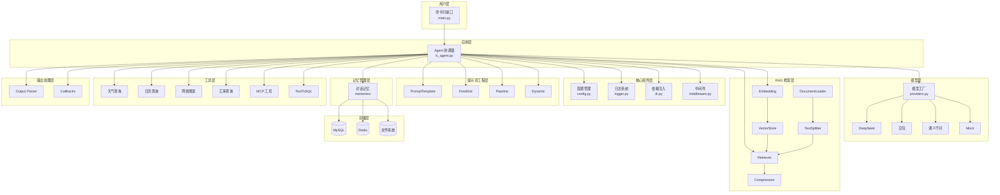
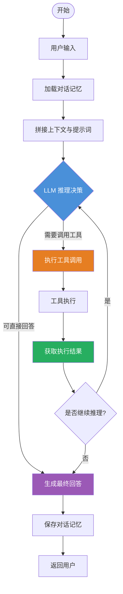
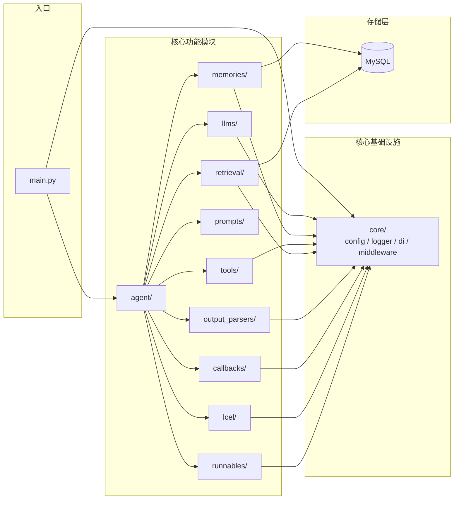

# x-langchain

[](LICENSE)
[](https://www.python.org/)
[](https://python.langchain.com/)
[](https://github.com/chain-engine/x-langchain/stargazers)

[English](README.en.md) | 中文

---

## 项目简介

`x-langchain` 是一个生产级的 LangChain 学习与实践项目，旨在帮助开发者系统学习和掌握 LangChain 框架的核心概念与工程化应用方法。

项目基于 LangChain / LangGraph 生态构建，提供开箱即用的多模型兼容、插件化工具系统、完整 RAG 工具链与 TextToSQL 解决方案。核心架构围绕 Agent 协调器展开，集成 ReAct 推理范式、多轮记忆管理、声明式工具注册与 MCP 协议支持，覆盖从智能对话、数据查询到企业知识库问答等典型业务场景，适用于 LLM 应用的原型验证与生产级落地。

---

## 核心特征

- **多模型兼容** — 统一模型工厂，支持 DeepSeek、豆包、阿里云通义千问等主流 LLM 后端，通过环境变量一键切换
- **Agent 能力** — 基于 LangGraph 的 ReAct Agent，支持模型、计划、行动、工具、记忆五大核心能力闭环
- **工具调用（Function Calling）** — 声明式工具注册机制，通过装饰器自动发现与热插拔，支持外部 API 与业务系统集成
- **TextToSQL 工具链** — 自然语言到 SQL 全链路：问题重写 → Schema 解析 → SQL 生成 → 验证执行 → 结果转换
- **MCP 协议支持** — 集成 Model Context Protocol，通过 langchain-mcp-adapters 接入 MCP 工具生态
- **RAG 完整工具链** — Embedding、VectorStore、DocumentLoader、TextSplitter、Retriever、语义记忆，一站式检索增强生成
- **多种 Memory 实现** — Buffer、Summary、Window、Entity、CombinedMemory，支持 Redis / 文件 / PostgreSQL / MongoDB 多后端持久化
- **输出解析器** — JSON、Pydantic、XML、Datetime、结构化输出等多种解析器，支持重试与容错
- **回调系统** — Token 统计、耗时分析、LangSmith 追踪、AIM 监控、文件日志，全链路可观测
- **LCEL 支持** — LangChain Expression Language 链式调用，支持异步执行与动态模型选择
- **安全合规** — API 密钥从环境变量加载，配置文件与代码分离，避免硬编码风险
- **插件化架构** — 模块化分层设计，核心组件松耦合，便于扩展与二次开发

---

## 项目结构

```
x-langchain/
├── src/                                    # 源代码目录
│   ├── __init__.py                         # 包初始化，导出所有模块
│   ├── main.py                             # 项目主入口，CLI 交互接口
│   │
│   ├── core/                               # 核心基础设施层
│   │   ├── config.py                       # 统一配置管理（pydantic-settings + YAML）
│   │   ├── logger.py                       # 日志系统（loguru）
│   │   ├── di.py                           # 依赖注入容器
│   │   ├── middleware.py                   # 中间件（输入验证 / 计时 / 迭代限制）
│   │   └── exceptions.py                   # 自定义异常体系
│   │
│   ├── llms/                               # LLM 模型层
│   │   └── providers.py                    # 多模型工厂（DeepSeek / 豆包 / 通义千问 / Mock）
│   │
│   ├── memories/                           # 记忆管理层
│   │   ├── memory.py                       # 基础记忆（ChatMessageHistory / BufferMemory）
│   │   ├── advanced_memory.py              # 高级记忆（Summary / Window / Entity / Combined）
│   │   └── chat_history.py                # 多存储后端（Redis / 文件 / PostgreSQL / MongoDB）
│   │
│   ├── agent/                              # Agent 协调层
│   │   └── lc_agent.py                     # LangGraph ReAct Agent 实现
│   │
│   ├── tools/                              # 工具层（插件化架构）
│   │   ├── base.py                         # 工具基类（BaseXTool）
│   │   ├── registry.py                     # 工具注册表（装饰器自动注册）
│   │   ├── weather_tool.py                 # 天气查询（高德 AMAP）
│   │   ├── calendar_tool.py               # 日历查询
│   │   ├── web_tool.py                     # 网络搜索（DuckDuckGo）
│   │   ├── exchange_rate_tool.py           # 汇率查询
│   │   ├── qiuchi_mcp/                    # 秋池 MCP 工具包
│   │   └── text_to_sql/                   # TextToSQL 工具链
│   │       ├── question_rewrite_tool.py    # 问题重写
│   │       ├── get_schema_tool.py          # Schema 解析
│   │       ├── generate_sql_tool.py        # SQL 生成
│   │       ├── validate_sql_tool.py        # SQL 验证
│   │       ├── execute_sql_tool.py         # SQL 执行
│   │       └── convert_to_natural_language_tool.py  # 结果转换
│   │
│   ├── prompts/                            # 提示词工程层
│   │   ├── prompt_loader.py               # YAML 模板加载器（支持变量渲染）
│   │   ├── templates.py                    # 基础模板（PromptTemplate / ChatPromptTemplate）
│   │   ├── few_shot.py                     # Few-shot 模板
│   │   ├── advanced_templates.py           # 高级模板（Pipeline / ChatMessage / FewShotChat）
│   │   └── templates/                      # YAML 提示词文件目录
│   │       ├── agent_system.yaml           # Agent 系统提示词
│   │       ├── question_rewrite.yaml       # 问题改写提示词
│   │       ├── generate_sql.yaml           # SQL 生成提示词
│   │       └── convert_to_natural_language.yaml  # 结果转换提示词
│   │
│   ├── chains/                             # 链式调用层
│   │   ├── llm_chain.py                    # LLM 链
│   │   ├── conversation_chain.py           # 对话链
│   │   └── rag_chain.py                    # RAG 链
│   │
│   ├── retrieval/                          # RAG 检索层
│   │   ├── embedding.py                    # Embedding 工厂（OpenAI / DashScope / Local / Mock）
│   │   ├── vectorstore.py                 # VectorStore 工厂（Chroma / FAISS / InMemory）
│   │   ├── document.py                     # Document / DocumentLoader / DirectoryLoader
│   │   ├── splitter.py                     # TextSplitter（Recursive / Token）
│   │   ├── retriever.py                    # Retriever（Vector / Ensemble / MultiQuery）
│   │   ├── compression.py                 # 压缩检索器（LLMCompactor / ChainFilter）
│   │   └── semantic_memory.py             # 语义记忆
│   │
│   ├── output_parsers/                     # 输出解析层
│   │   ├── json_parser.py                  # JSON 解析器
│   │   ├── pydantic_parser.py             # Pydantic 模型解析器
│   │   ├── list_parser.py                  # 列表解析器
│   │   ├── retry_parser.py                # 重试解析器
│   │   └── structured_parser.py           # 结构化 / XML / Datetime 解析器
│   │
│   ├── callbacks/                          # 可观测性层
│   │   ├── handlers.py                     # 标准处理器（Token / Timing / Tracing / Streaming）
│   │   └── community_handlers.py           # 社区处理器（StdOut / AIM / File / SensitiveInfo）
│   │
│   ├── runnables/                          # Runnable 模块（LCEL 工具）
│   │   ├── async_agent.py                  # 异步 Agent
│   │   ├── configurable.py                # 动态 LLM 选择
│   │   └── routines.py                     # 链式调用辅助
│   │
│   ├── lcel/                               # LCEL 模块（LangChain Expression Language）
│   │   ├── chain.py                        # LCEL 链式调用
│   │   └── lcel_utils.py                  # LCEL 工具函数
│   │
│   ├── constants/                          # 常量模块
│   │   ├── base.py                         # 基础常量
│   │   ├── develop.py                      # 开发相关常量
│   │   ├── streaming_modes.py              # 流式传输模式
│   │   └── agent.py                        # Agent 模式枚举
│   │
│   └── infras/                             # 基础设施层
│       └── mysql/                          # MySQL 数据库
│           ├── models.py                   # ORM 模型定义
│           ├── mysql.py                     # 数据库连接管理
│           └── operations.py               # 数据库操作封装
│
├── tests/                                  # 单元测试
├── docs/                                   # 项目文档
├── examples/                               # 示例代码（25+ 示例）
├── logs/                                   # 运行日志输出目录
├── data/                                   # 数据文件目录
├── config.yaml                             # YAML 配置文件
├── .env.example                            # 环境变量配置模板
├── pyproject.toml                          # 项目元数据与依赖管理
├── uv.toml                                 # uv 包管理器配置
├── pyrightconfig.json                      # Pyright 类型检查配置
├── langgraph.json                          # LangGraph 部署配置
├── Dockerfile                              # Docker 容器构建文件
├── setup.py                                # 兼容性安装脚本
└── LICENSE                                 # MIT 开源协议
```

---

## 系统架构

### 分层架构图



### ReAct 执行流程图



### 模块依赖关系图



---

## 快速开始

### 1. 环境要求

| 平台 | 要求 |
|------|------|
| **Windows** | Python 3.11+，推荐使用 PowerShell 或 Git Bash |
| **Linux** | Python 3.11+，任意 Shell |
| **macOS** | Python 3.11+，任意 Shell（Apple Silicon 需确保 Python 构建架构匹配） |

> 推荐使用 [`uv`](https://github.com/astral-sh/uv) 作为包管理器，兼顾速度与依赖解析能力

### 2. 项目克隆

```bash
git clone https://github.com/chain-engine/x-langchain.git
cd x-langchain
```

### 3. 依赖安装与同步

```bash
# 使用 uv（推荐）
uv sync

# 安装可选依赖（如 Gradio UI）
uv sync --extra ui
```

### 4. 环境配置

复制环境变量模板并编辑：

```bash
cp .env.example .env
```

`.env` 文件核心参数说明：

```env
# ===== LLM 模型配置（三选一）=====

# DeepSeek（推荐）
DEEPSEEK_API_KEY=sk-xxxxxxxxxxxxxxxxxxxxxxxxxxxxxxxx
DEEPSEEK_API_BASE=https://api.deepseek.com/v1
DEEPSEEK_MODEL_NAME=deepseek-v4-pro

# 豆包
DOUBAO_API_KEY=xxxxxxxx-xxxx-xxxx-xxxx-xxxxxxxxxxxx
DOUBAO_API_BASE=https://ark.cn-beijing.volces.com/api/v3
DOUBAO_MODEL_NAME=ep-xxxxxxxxxxxxxx

# 阿里云通义千问
ALIYUN_API_KEY=sk-xxxxxxxxxxxxxxxxxxxxxxxxxxxxxxxx
ALIYUN_MODEL_NAME=qwen-plus

# ===== 数据库配置（TextToSQL 功能需要）=====
DB_HOST=localhost
DB_PORT=3306
DB_USER=root
DB_PASSWORD=your_password
DB_NAME=your_database

# ===== 工具配置 =====
AMAP_API_KEY=your_amap_api_key      # 高德地图天气查询
MCP_ENABLED=false                    # MCP 协议开关
```

同时可编辑 `config.yaml` 调整 Agent、日志、中间件等高级配置。

### 5. 服务启动

#### 本地开发启动

```bash
# 使用默认模型（DeepSeek）
uv run src/main.py

# 或使用已注册的命令行入口
uv run x-langchain

# 通过环境变量指定模型
MODEL_NAME=deepseek uv run src/main.py
MODEL_NAME=doubao   uv run src/main.py
MODEL_NAME=tongyi   uv run src/main.py
```

#### Docker 容器部署

```bash
# 构建镜像
docker build -t x-langchain:latest .

# Linux / macOS
docker run -it --rm \
  -v $(pwd)/.env:/app/.env:ro \
  -v $(pwd)/logs:/app/logs \
  x-langchain:latest

# Windows PowerShell
docker run -it --rm `
  -v ${PWD}/.env:/app/.env:ro `
  -v ${PWD}/logs:/app/logs `
  x-langchain:latest
```

### 6. 常用工程命令

```bash
# 运行单元测试
uv run pytest tests/ -v

# 测试覆盖率报告
uv run pytest tests/ --cov=src --cov-report=term-missing

# 代码格式化
uv run ruff format src/ tests/

# 静态代码检查
uv run ruff check src/ tests/

# 自动修复可修复的 lint 问题
uv run ruff check --fix src/ tests/

# 类型检查
uv run pyright
```

---

## 技术栈清单

| 类别 | 技术 |
|------|------|
| **核心框架** | LangChain, LangGraph, langchain-core |
| **模型集成** | langchain-openai, langchain-community, langchain-dashscope, langchain-anthropic |
| **MCP 协议** | langchain-mcp-adapters |
| **数据存储** | MySQL（SQLAlchemy + PyMySQL / aiomysql） |
| **缓存** | Redis（可选，用于 ChatHistory 持久化） |
| **核心工具库** | pydantic, pydantic-settings, python-dotenv, pyyaml, duckduckgo-search, requests |
| **日志系统** | loguru |
| **类型检查** | Pyright |
| **代码规范** | Ruff（格式化 + Lint） |
| **测试框架** | pytest, pytest-cov |
| **包管理** | uv |
| **部署运维** | Docker |

---

## 许可证

本项目基于 [MIT License](LICENSE) 开源。

---

## 参考资料

- [Python 官方文档](https://docs.python.org/3.11/)
- [LangChain 官方文档](https://python.langchain.com/)
- [LangGraph 官方文档](https://langchain-ai.github.io/langgraph/)
- [uv 官方文档](https://docs.astral.sh/uv/)
- [Pydantic 官方文档](https://docs.pydantic.dev/)
- [SQLAlchemy 官方文档](https://docs.sqlalchemy.org/)
- [loguru 官方文档](https://loguru.readthedocs.io/)
- [Ruff 官方文档](https://docs.astral.sh/ruff/)
- [Docker 官方文档](https://docs.docker.com/)

---

## 联系方式

- **作者**：John Young（夜雨诗来）
- **邮箱**：john.young@foxmail.com
- **Gitee**：https://gitee.com/yeyushilai
- **GitHub**：https://github.com/yeyushilai
