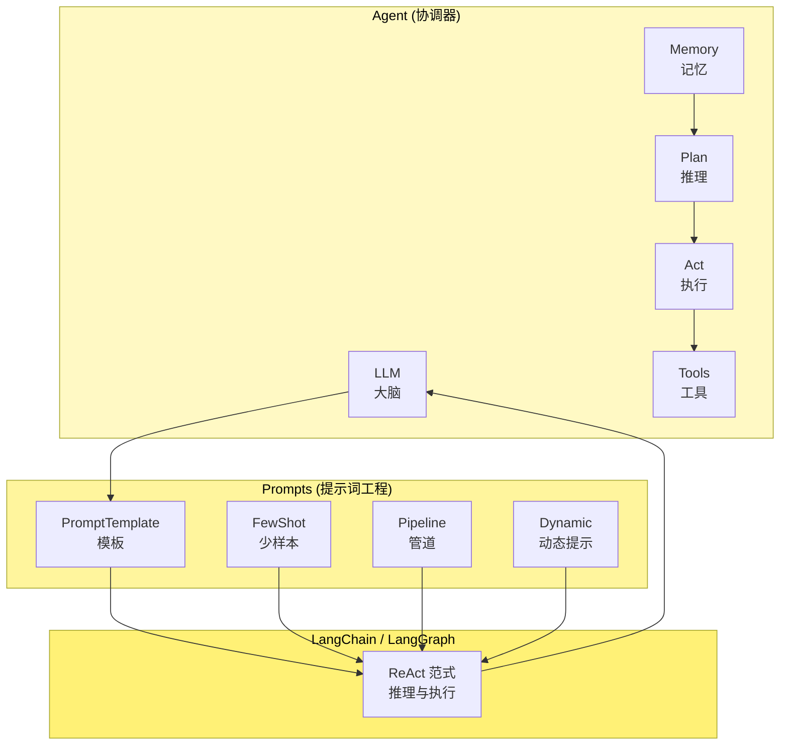
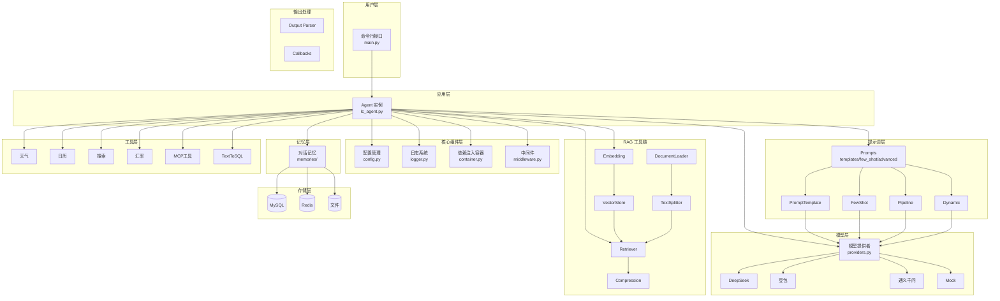
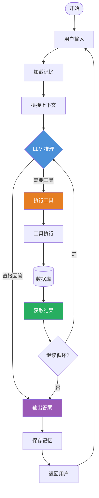
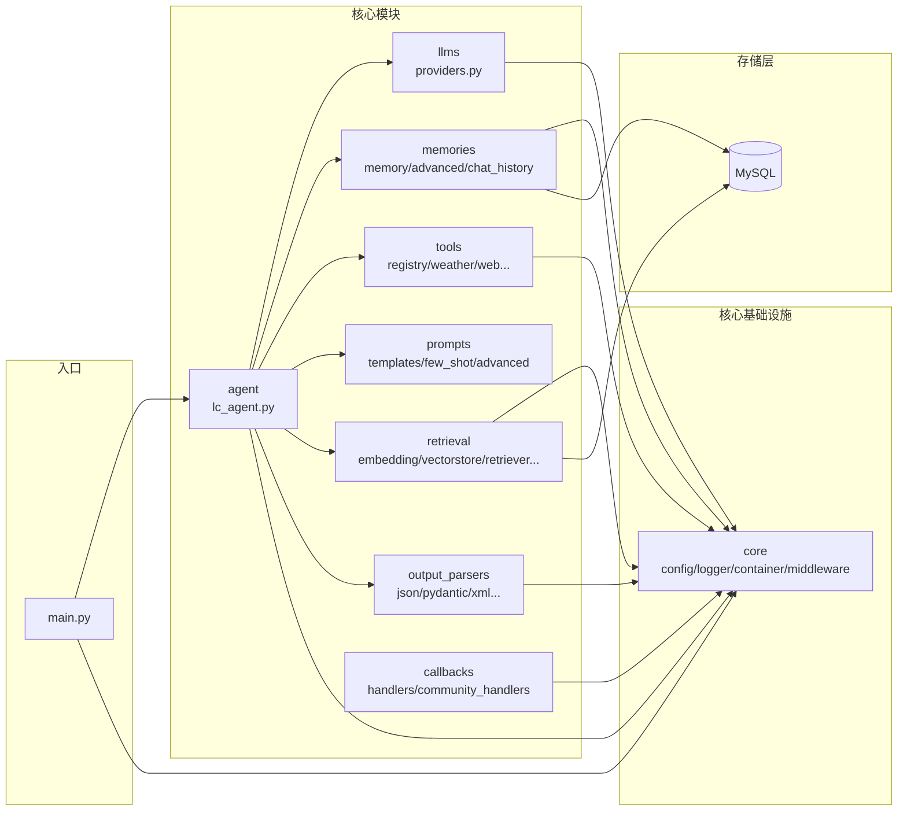

# x-langchain

`x-langchain` 是一个生产级的 LangChain 学习与实践项目，旨在帮助开发者系统学习和掌握 LangChain 框架的核心概念与应用方法。

**核心价值**：开箱即用的多模型支持、插件化工具系统、完整的 TextToSQL 解决方案

**适用场景**：智能客服、数据查询助手、企业知识库问答、LLM 应用原型开发

---

## 什么是 LangChain？

- **官方定义**："LangChain is a framework for developing applications powered by large language models"
- **Gartner 描述**："LLM application development frameworks like LangChain"

简单来说，`LangChain` 是一个帮助开发者快速构建基于大语言模型（LLM）应用的开发框架。

---

## 核心特性

- **多模型兼容** - 支持 DeepSeek、豆包、阿里云通义千问等主流 LLM 后端
- **Agent 能力** - 基于 LangGraph 的 ReAct Agent，支持模型、计划、行动、工具、记忆五大核心能力
- **工具调用（Function Calling）** - 通过声明式接口集成外部 API 与业务系统
- **TextToSQL 功能** - 支持自然语言到 SQL 的转换，包括问题重写、Schema 解析、SQL 生成、验证和执行
- **MCP 协议支持** - 集成 Model Context Protocol，支持 MCP 工具调用
- **RAG 完整工具链** - Embedding、VectorStore、DocumentLoader、TextSplitter、Retriever、SemanticMemory
- **多种 Memory 实现** - Buffer、Summary、Window、Entity、CombinedMemory 及 Redis/文件/Postgres/MongoDB 持久化
- **输出解析器** - JSON、Pydantic、XML、Datetime、结构化输出等多种解析器
- **回调系统** - Token 统计、耗时分析、LangSmith 追踪、AIM 监控、文件日志等
- **安全合规** - API 密钥管理（从环境变量加载，避免硬编码）
- **可观测性** - 集成结构化日志系统，便于监控和调试
- **插件化架构** - 基于装饰器的工具自动注册，支持热插拔

---

## 技术栈

| 类别 | 技术 |
|------|------|
| **核心框架** | LangChain, LangGraph, langchain-core |
| **模型集成** | langchain-openai, langchain-community, langchain-dashscope |
| **配置管理** | pydantic-settings, python-dotenv |
| **工具库** | duckduckgo-search, sqlalchemy, pymysql |
| **MCP 协议** | langchain-mcp-adapters |
| **日志系统** | loguru |
| **包管理** | uv |
| **部署** | Docker |

---

## 项目结构

```
x-langchain/
├── src/                                # 源代码目录
│   ├── __init__.py                     # 包初始化，导出所有模块
│   ├── main.py                         # 项目主入口，CLI 交互接口
│   │
│   ├── core/                           # 核心基础设施
│   │   ├── config.py                   # 配置管理（pydantic-settings）
│   │   ├── logger.py                   # 日志系统（loguru）
│   │   ├── container.py                 # 依赖注入容器
│   │   ├── middleware.py                # 中间件（输入验证/计时/迭代限制）
│   │   └── exceptions.py                # 自定义异常
│   │
│   ├── llms/                           # LLM 模块（模型提供者）
│   │   └── providers.py                 # 多模型工厂（DeepSeek/豆包/通义千问/Mock）
│   │
│   ├── memories/                        # Memory 模块（记忆管理）
│   │   ├── memory.py                   # 基础记忆（ChatMessageHistory/BufferMemory）
│   │   ├── advanced_memory.py           # 高级记忆（Summary/Window/Entity/Combined）
│   │   └── chat_history.py             # 多种存储后端（Redis/文件/Postgres/MongoDB）
│   │
│   ├── agent/                         # Agent 模块
│   │   ├── lc_agent.py                # LangChain Agent 实现（基于 LangGraph）
│   │   └── chat_history_service.py     # MySQL 持久化对话历史
│   │
│   ├── tools/                         # Tools 模块（工具系统）
│   │   ├── base.py                    # 工具基类（BaseXTool）
│   │   ├── registry.py                 # 工具注册表
│   │   ├── weather_tool.py             # 天气查询（高德 AMAP）
│   │   ├── calendar_tool.py            # 日历查询
│   │   ├── web_tool.py                # 网络搜索（duckduckgo）
│   │   ├── exchange_rate_tool.py       # 汇率查询
│   │   ├── qiuchi_mcp/                # 秋池 MCP 工具包
│   │   └── text_to_sql/               # TextToSQL 工具链
│   │       ├── question_rewrite_tool.py    # 问题重写
│   │       ├── get_schema_tool.py         # Schema 解析
│   │       ├── generate_sql_tool.py       # SQL 生成
│   │       ├── validate_sql_tool.py       # SQL 验证
│   │       ├── execute_sql_tool.py        # SQL 执行
│   │       └── convert_to_natural_language_tool.py  # 结果转换
│   │
│   ├── prompts/                        # Prompt 模块（提示词模板）
│   │   ├── templates.py               # 基础模板（PromptTemplate/ChatPromptTemplate）
│   │   ├── few_shot.py                # Few-shot 模板
│   │   └── advanced_templates.py       # 高级模板（Pipeline/ChatMessage/FewShotChat）
│   │
│   ├── chains/                         # Chain 模块（链式调用）
│   │   ├── llm_chain.py               # LLMChain
│   │   ├── conversation_chain.py       # 对话链
│   │   └── rag_chain.py               # RAG 链
│   │
│   ├── retrieval/                      # Retrieval 模块（RAG 基础设施）
│   │   ├── embedding.py                # Embedding 工厂（OpenAI/ DashScope/Local/Mock）
│   │   ├── vectorstore.py             # VectorStore 工厂（Chroma/FAISS/InMemory）
│   │   ├── document.py                # Document/DocumentLoader/DirectoryLoader
│   │   ├── splitter.py                # TextSplitter（Recursive/Token）
│   │   ├── retriever.py               # Retriever（Vector/Ensemble/MultiQuery）
│   │   ├── compression.py             # 压缩检索器（LLMCompactor/ChainFilter）
│   │   └── semantic_memory.py          # 语义记忆
│   │
│   ├── output_parsers/                 # Output Parser 模块（输出解析）
│   │   ├── json_parser.py             # JSON 解析器
│   │   ├── pydantic_parser.py         # Pydantic 模型解析器
│   │   ├── list_parser.py             # 列表解析器
│   │   ├── retry_parser.py            # 重试解析器
│   │   └── structured_parser.py        # 结构化/XML/Datetime 解析器
│   │
│   ├── callbacks/                      # Callback 模块（可观测性）
│   │   ├── handlers.py                # 标准处理器（Token/Timing/Tracing/Streaming）
│   │   └── community_handlers.py       # 社区处理器（StdOut/AIM/File/SensitiveInfo）
│   │
│   ├── runnables/                     # Runnable 模块（LCEL 工具）
│   │   ├── async_agent.py             # 异步 Agent
│   │   ├── configurable.py            # 动态 LLM 选择
│   │   └── routines.py                # 链式调用辅助
│   │
│   ├── lcel/                          # LCEL 模块（LangChain Expression Language）
│   │   ├── chain.py                  # LCEL 链式调用
│   │   └── lcel_utils.py             # LCEL 工具函数
│   │
│   ├── constants/                      # 常量模块
│   │   ├── base.py                   # 基础常量
│   │   ├── develop.py                 # 开发相关常量
│   │   ├── streaming_modes.py         # 流式传输模式
│   │   └── agent.py                   # Agent 模式
│   │
│   └── infras/                        # 基础设施层
│       └── mysql/                    # MySQL 数据库
│           ├── models.py              # ORM 模型
│           ├── mysql.py               # 数据库连接
│           └── operations.py          # 数据库操作
│
├── tests/                              # 测试模块
├── docs/                               # 文档目录
├── examples/                           # 示例代码
├── logs/                               # 日志目录
├── .env.example                        # 环境变量配置示例
├── pyproject.toml                      # 项目元数据和依赖
├── Dockerfile                          # Docker 构建文件
└── README.md                           # 项目文档
```

---

## 系统架构

### 核心架构



### 组件职责

| 组件 | 目录 | 职责 |
|------|------|------|
| LLM | `llms/` | 统一封装多种模型提供者（DeepSeek/豆包/通义千问/Mock） |
| Memory | `memories/` | 对话历史记忆（基础 + 高级 + 多种持久化后端） |
| Plan/Act | `agent/` | 推理-行动循环，基于 LangGraph ReAct Agent 实现 |
| Prompts | `prompts/` | 提示词模板（基础/Few-shot/管道/动态提示词） |
| Tools | `tools/` | 插件化工具系统（天气/搜索/数据库/MCP/TextToSQL） |
| Retrieval | `retrieval/` | RAG 完整工具链（Embedding/VectorStore/Retriever） |
| Output Parser | `output_parsers/` | 结构化输出解析（JSON/Pydantic/XML/Datetime） |
| Callback | `callbacks/` | 可观测性（Token 统计/耗时分析/日志追踪） |

### 分层架构图



### ReAct 执行循环



### 模块依赖关系



---

## 快速开始

### 环境要求

| 环境 | 要求 |
|------|------|
| **Windows** | Python 3.11+, 推荐使用 PowerShell 或 Git Bash |
| **Linux/macOS** | Python 3.11+, 任意 Shell |

> 推荐使用 [`uv`](https://github.com/astral-sh/uv) 作为包管理器，亦可兼容 `pip`

### 项目克隆

```bash
git clone https://github.com/chain-engine/x-langchain.git
cd x-langchain
```

### 依赖安装

```bash
# 使用 uv（推荐）
uv sync

# 或使用 pip
pip install -e .
```

### 配置文件创建

```bash
# 复制配置模板
cp .env.example .env
```

编辑 `.env` 文件，配置必要的 API 密钥：

```env
# DeepSeek API（推荐）
DEEPSEEK_API_KEY=sk-xxxxxxxxxxxxxxxxxxxxxxxxxxxxxxxx
DEEPSEEK_API_BASE=https://api.deepseek.com/v1
DEEPSEEK_MODEL_NAME=deepseek-chat

# 或豆包 API
DOUBAO_API_KEY=xxxxxxxx-xxxx-xxxx-xxxx-xxxxxxxxxxxx
DOUBAO_API_BASE=https://ark.cn-beijing.volces.com/api/v3
DOUBAO_MODEL_NAME=ep-xxxxxxxxxxxxxx

# 或阿里云通义千问
ALIYUN_API_KEY=sk-xxxxxxxxxxxxxxxxxxxxxxxxxxxxxxxx
ALIYUN_MODEL_NAME=qwen-plus

# 数据库配置（TextToSQL 功能需要）
DB_HOST=localhost
DB_PORT=3306
DB_USER=root
DB_PASSWORD=your_password
DB_NAME=your_database
```

### 本地启动

```bash
# 使用默认模型（DeepSeek）
uv run src/main.py

# 或使用已安装的命令行入口
uv run x-langchain

# 通过环境变量指定模型
MODEL_NAME=deepseek uv run src/main.py
MODEL_NAME=doubao uv run src/main.py
MODEL_NAME=tongyi uv run src/main.py
```

### Docker 启动

```bash
# 构建镜像
docker build -t x-langchain:latest .

# 运行容器（挂载配置和日志目录）
docker run -it --rm \
  -v $(pwd)/.env:/app/.env:ro \
  -v $(pwd)/logs:/app/logs \
  x-langchain:latest

# Windows PowerShell
docker run -it --rm `
  -v ${PWD}/.env:/app/.env:ro `
  -v ${PWD}/logs:/app/logs `
  x-langchain:latest
```

---

## 核心模块详解

### 1. Memories 模块

提供多种对话记忆实现：

```python
from memories import (
    # 基础记忆
    ConversationMemory,        # 对话记忆（支持上下文窗口）
    BufferMemory,              # 缓冲区记忆

    # 高级记忆
    ConversationSummaryMemory, # 摘要记忆（自动压缩历史）
    ConversationBufferWindowMemory,  # 窗口记忆（保留最近 N 条）
    ConversationEntityMemory,  # 实体记忆（提取实体关系）
    CombinedMemory,           # 组合记忆

    # 多种存储后端
    create_chat_history,      # 工厂函数创建 ChatHistory
    RedisChatHistory,         # Redis 存储
    FileChatHistory,          # 文件存储
    PostgresChatHistory,      # PostgreSQL 存储
    MongoDBChatHistory,       # MongoDB 存储
)
```

### 2. Retrieval 模块

RAG 完整工具链：

```python
from retrieval import (
    # Embedding
    EmbeddingFactory,
    OpenAIEmbedding,
    DashScopeEmbedding,
    LocalEmbedding,

    # VectorStore
    VectorStoreFactory,
    ChromaVectorStore,
    FAISSVectorStore,
    InMemoryVectorStore,

    # Document
    Document,
    DocumentLoader,
    DirectoryLoader,

    # Splitter
    RecursiveTextSplitter,
    TokenTextSplitter,

    # Retriever
    VectorRetriever,
    EnsembleRetriever,
    MultiQueryRetriever,
    ContextualCompressionRetriever,  # 新增：压缩检索器
)
```

### 3. Output Parsers 模块

结构化输出解析：

```python
from output_parsers import (
    # 基础解析器
    JsonOutputParser,
    PydanticOutputParser,
    StrOutputParser,
    CommaSeparatedListOutputParser,
    RetryOutputParser,

    # 高级解析器
    StructuredOutputParser,    # 通用结构化输出
    XmlOutputParser,           # XML 格式
    DatetimeOutputParser,       # 日期时间
)
```

### 4. Callbacks 模块

可观测性处理器：

```python
from callbacks import (
    # 标准处理器
    TokenCountCallbackHandler,   # Token 统计
    TimingCallbackHandler,       # 耗时分析
    TracingCallbackHandler,     # LangSmith 追踪
    StreamingCallbackHandler,   # 流式输出

    # 社区处理器
    StdOutCallbackHandler,       # 标准输出
    AimCallbackHandler,          # AIM 监控
    FileCallbackHandler,        # 文件日志
    SensitiveInfoCallbackHandler,  # 敏感信息过滤
    EventLogCallbackHandler,    # 事件日志
)
```

### 5. Prompts 模块

提示词模板：

```python
from prompts import (
    # 基础模板
    PromptTemplate,
    ChatPromptTemplate,
    FewShotPromptTemplate,

    # 高级模板
    PipelinePromptTemplate,      # 多级管道模板
    ChatMessagePromptTemplate,  # 消息级别模板
    FewShotChatMessagePromptTemplate,  # 少样本聊天
    DynamicPipelinePromptTemplate,  # 动态管道
)
```

---

## 插件化工具系统

x-langchain 提供插件化的工具管理系统，开发者可轻松添加新工具，无需修改核心代码。

### 核心特性

- **自动注册** - 使用 `@register_tool` 装饰器自动注册工具
- **工具发现** - 自动扫描 `tools/` 目录，发现新工具
- **类别管理** - 按类别组织工具，便于管理和过滤
- **向后兼容** - 完全兼容现有工具代码

### 快速开始

创建新工具只需三步：

```python
# 1. 在 tools/ 目录下创建新文件
# tools/my_tool.py

# 2. 使用装饰器注册工具
from tools.registry import register_tool

@register_tool(name="my_tool", category="custom", description="我的工具")
class MyTool:
    def __init__(self):
        self.name = "my_tool"
        self.description = "我的自定义工具"

    def run(self, param: str) -> str:
        return f"处理参数: {param}"

# 3. 完成！工具会在模块导入时自动注册
```

### 工具查询

```python
from tools import ToolRegistry

# 检查工具是否存在
if ToolRegistry.contains("my_tool"):
    tool = ToolRegistry.get("my_tool")

# 获取所有工具
all_tools = ToolRegistry.get_all()

# 按类别获取工具
custom_tools = ToolRegistry.get_all(category="custom")

# 获取统计信息
stats = ToolRegistry.get_stats()
print(f"总工具数: {stats['total_tools']}")
```

> 详细文档请参考 [插件开发指南](docs/插件开发指南.md)

---

## 存储配置

### 数据库配置（TextToSQL）

项目支持 MySQL 数据库连接，用于 TextToSQL 功能：

```env
# 分项配置
DB_HOST=localhost
DB_PORT=3306
DB_USER=root
DB_PASSWORD=your_password
DB_NAME=your_database

# 或使用完整 URL（优先级更高）
DB_URL=mysql+pymysql://${DB_USER}:${DB_PASSWORD}@${DB_HOST}:${DB_PORT}/${DB_NAME}
```

---

## 常用命令

```bash
# 运行测试
uv run python -m pytest

# 运行特定测试模块
uv run python -m pytest tests/test_providers.py -v

# 代码格式化（如果安装了 ruff）
uv run ruff format .

# 类型检查（如果安装了 pyright）
uv run pyright
```

---

## 许可证

本项目采用 MIT 许可证，详见 [LICENSE](LICENSE) 文件。

---

## 参考资料

- [LangChain 官方文档](https://python.langchain.com/docs/get_started/introduction)
- [LangChain 中文文档](https://langchain-doc.cn/v1/python/langchain/overview.html)
- [LangGraph 官方文档](https://langchain-ai.github.io/langgraph/)
- [FastAPI 官方文档](https://fastapi.tiangolo.com/)
- [Python 官方文档](https://docs.python.org/3/)
- [uv 包管理器](https://github.com/astral-sh/uv)
- [DeepSeek 官方文档](https://platform.deepseek.com/docs/api)
- [豆包官方文档](https://www.doubao.com/)
- [阿里云通义千问](https://help.aliyun.com/product/1081203.html)

---

## 联系方式

| 项目 | 信息 |
|------|------|
| **作者** | John Young（夜雨诗来） |
| **邮箱** | john.young@foxmail.com |
| **Gitee** | https://gitee.com/yeyushilai |
| **GitHub** | https://github.com/yeyushilai |
| **项目地址** | https://github.com/chain-engine/x-langchain |
